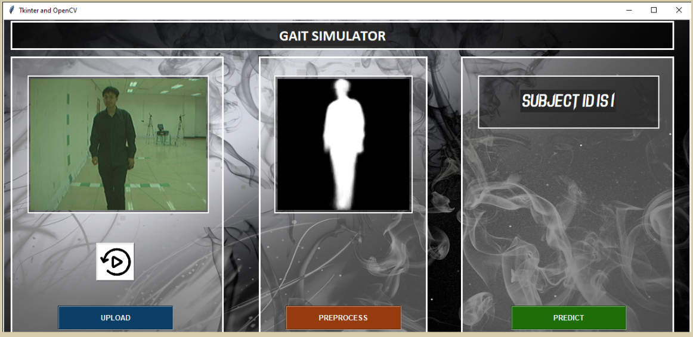

# DNN for gait recognition in Keras

--> This research involves using a Deep Neural Network to extract the properties of human motion automatically, and then using these features to validate the identity of the person in motion. A self-created Convolutional Neural Network with a test accuracy of over 96 percent can be found in this repository.

--> A fully functional app version of the Gait Recognition is also available.

--> For downloading Full CASIA-B dataset you must follow the steps present here http://www.cbsr.ia.ac.cn/users/szheng/?page_id=71

--> GEI Dataset is available at https://drive.google.com/file/d/1haa6uGqrdZG-iZRAuJi7lZG5IQCpwmOE/view?usp=sharing

Methods:

    |- Image Extration from Database
    
    |- Converting to Threshold Images
    
    |- Extracting Region of Interest and combining all images to form Gait Energy Images(GEI)
    
    |- Building GEIVnet
    
    |- Passing the GEI and training them
    
    |- Building 3 different networks and checking accuracy through CMC Curve
    
    
| Input Size  | Learning Rate | Model  | EER(%) | Rank1 ACC |
| ------------- | ------------- | ------------- | ------------- | ------------- |
| 32*32  | 1e-5  | V3  | 0.40  | 99.63%  |
| 32*32  | 1e-4|1e-5  | V6  | 0.18  | 99.69%  |
| 120*120  | 1e-4|1e-5  | v4+LRN  | 0.97  | 99.81%  |

This the preview of the app where first you need to locate the video of the app inside your system and then it is going to identify the person inside the video.

